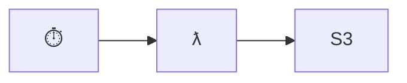

# S3 Uploader
Given a source url, sets up a daily EventBridge schedule to fetch content from source, and write response to a destination S3 bucket.

```mermaid
flowchart LR
    EB["⏱️"]
    Lambda["ƛ"]
    S3["S3"]
    
    EB --> Lambda --> S3

```

